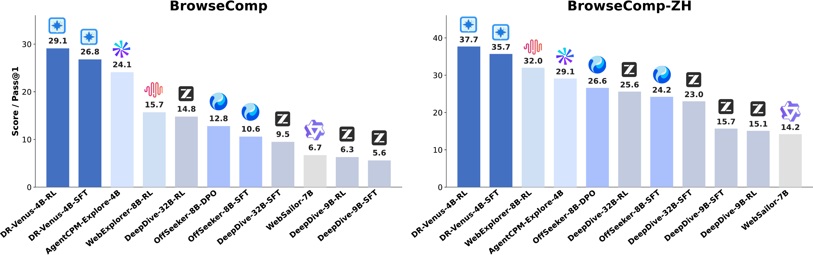
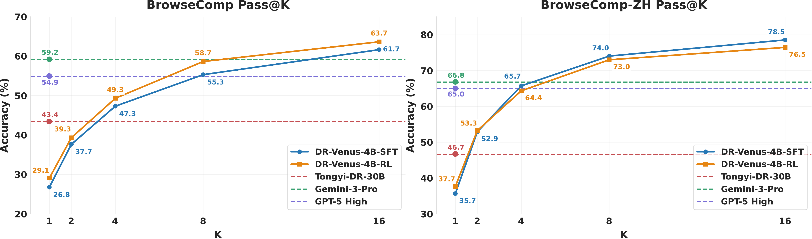

<div align="center">

<h1>
  
  DR-Venus
</h1>

**Towards Frontier Edge-Scale Deep Research Agents with Only 10K Open Data**

<p>
  <a href="https://github.com/inclusionAI/DR-Venus">
    
  </a>
  <a href="https://huggingface.co/inclusionAI/DR-Venus-4B-SFT">
    
  </a>
  <a href="https://huggingface.co/inclusionAI/DR-Venus-4B-RL">
    
  </a>
  <a href="https://huggingface.co/collections/inclusionAI/DR-Venus">
    
  </a>
  <a href="#">
    
  </a>
</p>

<p>
  <a href="#-news">News</a> &nbsp;|&nbsp;
  <a href="#-overview">Overview</a> &nbsp;|&nbsp;
  <a href="#-main-results">Main Results</a> &nbsp;|&nbsp;
  <a href="#-data-pipeline">Data Pipeline</a> &nbsp;|&nbsp;
  <a href="#-quick-start">Quick Start</a> &nbsp;|&nbsp;
  <a href="#-citation">Citation</a>
</p>

</div>

---

**DR-Venus** is a **4B-parameter** deep research agent trained *entirely on open data*. It establishes a new small-model frontier on multiple deep research benchmarks, demonstrating that strong agentic capabilities can emerge from careful data curation and effective training strategies at edge scale.

<p align="center">
  
</p>
<p align="center">
  <em>Figure 1: Overview of the DR-Venus training pipeline.</em>
</p>

<table>
  <tr>
    <td><b>Backbone</b></td>
    <td><a href="https://huggingface.co/Qwen/Qwen3-4B-Thinking-2507">Qwen3-4B-Thinking-2507</a></td>
  </tr>
  <tr>
    <td><b>Training Data</b></td>
    <td>Open-data only (~10K trajectories)</td>
  </tr>
  <tr>
    <td><b>Tool Protocol</b></td>
    <td><code>search</code> + <code>visit</code></td>
  </tr>
  <tr>
    <td><b>Interaction Horizon</b></td>
    <td>Up to 200 tool-call steps</td>
  </tr>
  <tr>
    <td><b>Context Length</b></td>
    <td>200K+ (training) / 256K (inference)</td>
  </tr>
</table>

##  News

- **`2026-04-22`** &ensp; Released model checkpoints: [`DR-Venus-4B-SFT`](https://huggingface.co/inclusionAI/DR-Venus-4B-SFT) and [`DR-Venus-4B-RL`](https://huggingface.co/inclusionAI/DR-Venus-4B-RL).
- **`2026-04-22`** &ensp; Released the DR-Venus technical report.
- **`2026-04-22`** &ensp; Open-sourced the full training and inference codebase.

##  Overview

The core goal of DR-Venus is to build a strong edge-scale deep research agent under limited open-data supervision by improving both **data quality** and **effective data utilization**. The project consists of three stages:

| Stage | Description | Code |
|:------|:------------|:----:|
| **1. SFT** | Convert raw REDSearcher trajectories into a unified agent format, clean noisy tool interactions, filter for correctness, and upweight long-horizon traces via turn-aware resampling before supervised fine-tuning. | [`SFT/`](SFT/) |
| **2. RL** | Starting from the SFT checkpoint, apply long-horizon reinforcement learning with [IGPO](https://github.com/GuoqingWang1/IGPO)-style information gain rewards and turn-level format-aware penalties. | [`RL/`](RL/) |
| **3. Inference** | Deploy the trained model with the same `search` + `visit` tool protocol used during training. | [`Inference/`](Inference/) |

##  Main Results

DR-Venus-4B establishes a strong small-model frontier on multiple deep research benchmarks.

### Comparison with Small Open Models

| Model | BrowseComp | BrowseComp-ZH | GAIA (Text) | xBench-DS-2505 | xBench-DS-2510 | DeepSearchQA |
|:------|:----------:|:-------------:|:-----------:|:--------------:|:--------------:|:------------:|
| DeepDive-9B-SFT | 5.6 | 15.7 | -- | 35.0 | -- | -- |
| DeepDive-9B-RL | 6.3 | 15.1 | -- | 38.0 | -- | -- |
| WebSailor-7B | 6.7 | 14.2 | 37.9 | 34.3 | -- | -- |
| OffSeeker-8B-SFT | 10.6 | 24.2 | 47.6 | 48.0 | -- | -- |
| OffSeeker-8B-DPO | 12.8 | 26.6 | 51.5 | 49.0 | -- | -- |
| WebExplorer-8B-RL | 15.7 | 32.0 | 50.0 | 53.7 | 23.0 | 17.8 |
| AgentCPM-Explore-4B | 24.1 | 29.1 | 63.9 | 70.0 | 34.0 | 32.8 |
| [DR-Venus-4B-SFT](https://huggingface.co/inclusionAI/DR-Venus-4B-SFT) | 26.8 | 35.7 | 65.4 | 69.0 | 35.3 | 37.7 |
| **[DR-Venus-4B-RL](https://huggingface.co/inclusionAI/DR-Venus-4B-RL)** | **29.1** | **37.7** | 64.4 | **74.7** | **40.7** | **39.6** |

> **Key takeaways:**
> - `DR-Venus-4B-SFT` already outperforms prior small open agents on most tracked benchmarks.
> - `DR-Venus-4B-RL` further improves over SFT by **+2.3** on BrowseComp and **+2.0** on BrowseComp-ZH.
> - RL mainly improves long-horizon execution reliability, formatting stability, and tool-use calibration.

<p align="center">
  
</p>
<p align="center">
  <em>Figure 2: Pass@K comparison on BrowseComp and BrowseComp-ZH.</em>
</p>

##  Data Pipeline

The SFT pipeline is built from open [REDSearcher](https://github.com/RedSearchAgent/REDSearcher) trajectories and focuses on making limited supervision more useful for a small model.

```
Raw REDSearcher Trajectories (10,001)
  │
  ├── Structural Cleaning    ── environment alignment, tool normalization,
  │                              disallowed-tool pruning, duplicate removal
  ├── Correctness Filtering  ── keep trajectories with correct final answers
  │                              → 9,365 trajectories
  └── Turn-Aware Resampling  ── upweight longer trajectories to emphasize
                                 deep research behavior
                                 → 18,745 final SFT instances
```

For RL, we use open QA supervision curated from the [REDSearcher RL data source](https://huggingface.co/datasets/Zchu/REDSearcher_RL_1K).

##  Quick Start

Each subdirectory has its own dependencies and entry scripts. Refer to the subproject READMEs for full details.

### 1. Inference

Run the trained model with `search` and `visit` tools:

```bash
cd Inference
pip install -r requirements.txt

# Configure API credentials used by the tool server first
bash run_demo.sh

# Or launch the web demo
bash run_web_demo.sh --model_path <MODEL_PATH> --num_gpus <NUM_GPUS>
```

> See [`Inference/README.md`](Inference/README.md) for the full setup guide.

### 2. SFT

Prepare cleaned trajectories and train the SFT checkpoint:

```bash
cd SFT
pip install -e .
pip install -r requirements.txt

# Optional: convert raw RED trajectories into SFT-ready parquet
python data_clean/prepare_trajectories.py \
  --input <RAW_PARQUET_OR_DIR> \
  --output-dir <OUTPUT_DIR>

# Run supervised fine-tuning
bash train_sft.sh
```

> See [`SFT/README.md`](SFT/README.md) for data format, environment variables, and checkpoint merging.

### 3. RL

Continue from the SFT checkpoint with long-horizon RL:

```bash
cd RL
pip install -r requirements.txt

# Edit .env and train_igpo.sh first
bash train_igpo.sh
```

> See [`RL/README.md`](RL/README.md) for reward configuration, rollout setup, and troubleshooting.

##  External Services

Both [`Inference/`](Inference/) and [`RL/`](RL/) depend on external tools and model endpoints. SFT does **not** require these.

| Service | Purpose |
|:--------|:--------|
| [Serper](https://serper.dev/) | Web search |
| [Jina Reader](https://jina.ai/) | Webpage fetching |
| OpenAI-compatible API | Page summarization |
| OpenAI-compatible judge model | RL reward evaluation |

##  Repository Layout

```
DR-Venus/
├── README.md
├── assets/
│   ├── dr-venus-overview.png
│   └── dr-venus-passk.png
├── SFT/
│   ├── data_clean/          # RED trajectory conversion & cleaning
│   ├── scripts/             # Checkpoint merge utilities
│   ├── sft_shells/
│   ├── train_sft.sh
│   └── README.md
├── RL/
│   ├── configs/
│   ├── data/
│   ├── tool_server/
│   ├── train_igpo.sh
│   └── README.md
├── Inference/
│   ├── tool_server/
│   ├── run_demo.sh
│   ├── run_web_demo.sh
│   └── README.md
└── model_cards/
```

##  Acknowledgements

DR-Venus builds on several strong open-source foundations:

- [**verl**](https://github.com/volcengine/verl) -- training infrastructure
- [**IGPO**](https://github.com/GuoqingWang1/IGPO) -- RL algorithmic foundation
- [**Tongyi DeepResearch**](https://github.com/Alibaba-NLP/DeepResearch) -- deep research agent design references
- [**REDSearcher**](https://github.com/RedSearchAgent/REDSearcher) -- open-data trajectories and related tooling

##  Citation

```bibtex
@misc{dr_venus_2026,
  title  = {DR-Venus: Towards Frontier Edge-Scale Deep Research Agents
            with Only 10K Open Data},
  author = {Venus Team, Sunhao Dai, Yong Deng, Jinzhen Lin,
            Yucheng Song, Guoqing Wang, Xiaofeng Wu, Yuqi Zhou,
            Shuo Yang, Zhenzhe Ying, Zhanwei Zhang,
            Changhua Meng, Weiqiang Wang},
  year   = {2026},
}
```

<div align="center">

---

<sub>Made with care by the Venus Team</sub>

</div>
