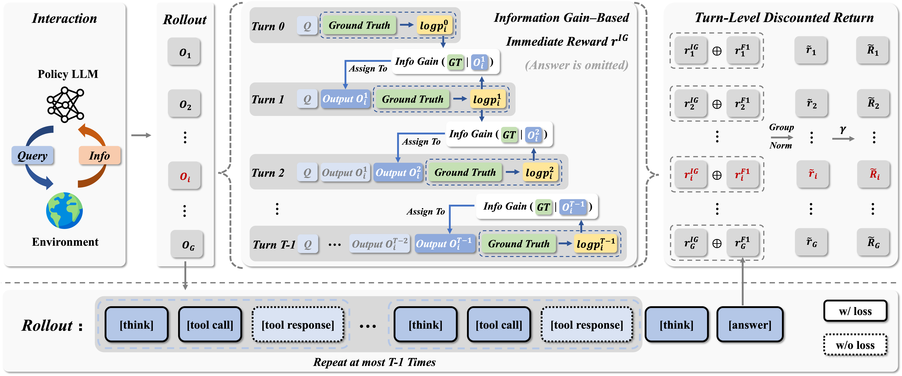

# IGPO for Ultra Long-Horizon Deep Research

This repository trains **Deep Research agents in the ultra-long-horizon
regime** — up to **200+ tool-use turns per rollout** of search, visit, and
cross-checking — with **IGPO (Information Gain-based Policy Optimization)**,
proposed by Wang et al. at **ICLR 2026**. At this scale, outcome-only RL
fails on three fronts: (i) **poor data efficiency** — one terminal reward
per trajectory wastes supervision on data-scarce agentic tasks; (ii)
**advantage collapse** — most rollouts share identical returns, driving
GRPO's advantage toward zero; (iii) **no fine-grained credit assignment**
— intermediate turns never learn which step actually moved the policy
closer to the answer. IGPO addresses all three by augmenting the terminal
reward with a **dense per-turn signal equal to the marginal increase in
the policy's probability of producing the correct answer**, derived
directly from the model's belief updates — no external reward model, no
Monte-Carlo estimation. Combined with outcome rewards inside a GRPO-style
objective, every turn contributes supervision and training stays stable
across long trajectories.

**Original IGPO Paper & Code**

[](https://arxiv.org/abs/2510.14967)
[](https://huggingface.co/papers/2510.14967)
[](https://github.com/GuoqingWang1/IGPO)

> If you use this code in your research, please cite the original IGPO paper
> (see [§6 Citation](#6-citation)).

### Method Overview

<p align="center">
  
</p>

<p align="center"><em>Figure reproduced from the original IGPO paper (Wang et al., ICLR 2026). See <a href="https://arxiv.org/abs/2510.14967">arXiv:2510.14967</a> for full details.</em></p>

---

## Table of Contents

- [1. Installation](#1-installation)
- [2. API Setup (.env)](#2-api-setup-env)
  - [2.1 Overview](#21-overview)
  - [2.2 Web Search — Serper](#22-web-search--serper)
  - [2.3 Web Visit — Jina Reader](#23-web-visit--jina-reader)
  - [2.4 Page Summarizer — OpenAI-Compatible LLM](#24-page-summarizer--openai-compatible-llm)
  - [2.5 LLM-as-Judge — Reward Model](#25-llm-as-judge--reward-model)
  - [2.6 Networking & Proxy](#26-networking--proxy)
- [3. Data Preparation](#3-data-preparation)
- [4. Training](#4-training)
- [5. Troubleshooting](#5-troubleshooting)
- [6. Citation](#6-citation)
- [7. License & Acknowledgements](#7-license--acknowledgements)

---

## 1. Installation

Requires Python 3.10+, CUDA-capable NVIDIA GPU(s), and ~80 GB disk for the
base model and data.

```bash
git clone https://github.com/inclusionAI/DR-Venus
cd DR-Venus/RL

python -m venv .venv && source .venv/bin/activate    # or use conda
pip install --upgrade pip
pip install -r requirements.txt
```

`flash-attn` is listed in `requirements.txt` and may need a matching CUDA
toolchain. See the [flash-attention install notes](https://github.com/Dao-AILab/flash-attention#installation-and-features)
if pip resolution fails.

---

## 2. API Setup (.env)

All external services (search / visit / summarization / LLM judge) are
configured through a single project-root `.env` file (git-ignored).

```bash
cp .env.example .env
# edit .env and fill in the values described below
```

### 2.1 Overview

| Env var | Consumer | Required? |
|---|---|---|
| `SERPER_KEY_ID` | `tool_server/tool_search.py` (web search) | Yes — for rollout |
| `JINA_API_KEYS` | `tool_server/tool_visit.py` (web visit) | Yes — for rollout |
| `API_KEY`, `API_BASE`, `SUMMARY_MODEL_NAME` | `tool_server/tool_visit.py` (page summarizer) | Yes — for rollout |
| `JUDGE_MODEL_NAME` | `verl/utils/reward_score/llm_judge.py` | Yes — when `train_reward_type=llm` (the default) |
| `JUDGE_API_BASE`, `JUDGE_API_KEY` | same as above | No — only if judge lives on a separate endpoint |
| `ENABLE_JUDGE_THINKING` | LLM judge thinking toggle | No — defaults to `true` |
| `PROXY` | `tool_server/tool_visit.py` (Jina requests) | No — only if your network needs a proxy |
| `GLOO_SOCKET_IFNAME` | PyTorch distributed (Gloo/NCCL NIC selection) | Yes — on multi-GPU/multi-node |

> **Syntax note:** `.env` is sourced by bash. Every line must be valid bash:
> `KEY=value` (no spaces around `=`), `KEY="value"` (quote if value contains
> spaces, `:`, `/`, or other shell-special characters). Comments must start
> at column 0.

### 2.2 Web Search — Serper

`tool_server/tool_search.py` calls `google.serper.dev` for Google-search
results during agent rollouts.

- Sign up at <https://serper.dev/> (free tier available).
- Copy your API key into `.env`:

  ```bash
  SERPER_KEY_ID=your-serper-api-key
  ```

### 2.3 Web Visit — Jina Reader

`tool_server/tool_visit.py` uses Jina Reader (`https://r.jina.ai/`) to fetch
clean, LLM-ready page content from arbitrary URLs.

- Sign up at <https://jina.ai/> and grab a Reader API key.
- Copy into `.env`:

  ```bash
  JINA_API_KEYS=your-jina-api-key
  ```

### 2.4 Page Summarizer — OpenAI-Compatible LLM

After a page is fetched, `tool_visit.py` calls a cheap/fast LLM to extract
and summarize the content relevant to the agent's goal. Any OpenAI-compatible
endpoint works: **OpenAI**, **DeepSeek**, **vLLM**, **SGLang**, **Ollama**,
**LiteLLM proxy**, etc.

```bash
API_KEY=your-openai-compatible-api-key
API_BASE=https://your-endpoint/v1                 # must include /v1
SUMMARY_MODEL_NAME=Qwen3-30B-A3B-Instruct-2507    # example — any small/medium instruction-tuned model works
```

The model should be a small-to-medium, instruction-tuned model. A context
window of **≥ 128k tokens** is recommended, because raw page content is
truncated to ~95k tokens before being sent (`tool_server/tool_visit.py`).

### 2.5 LLM-as-Judge — Reward Model

When `reward_model.train_reward_type=llm` (the default configured in
`train_igpo.sh`), each rollout's final `<answer>` is judged against the
ground truth by a strong LLM. The judge verdict becomes the training reward.

**Minimum configuration** (re-use the same gateway as the summarizer):

```bash
JUDGE_MODEL_NAME=Qwen3-235B-A22B-Instruct-2507    # example — any strong instruction-following LLM works
```

Sufficient when the judge is deployed on the same `API_BASE` as the
summarizer; the code falls back to `API_BASE` / `API_KEY` when
`JUDGE_API_BASE` / `JUDGE_API_KEY` are unset. If the judge lives on a
separate endpoint:

```bash
JUDGE_API_BASE=https://your-judge-endpoint/v1
JUDGE_API_KEY=your-judge-api-key
JUDGE_MODEL_NAME=...
```

**Pick a strong judge.** Weak judges silently degrade training. Known-good
choices include `Qwen3-235B-A22B-Instruct-*`, `DeepSeek-V3`, `gpt-4o`, and
`claude-3.5-sonnet` (via LiteLLM), but any instruction-tuned model with
solid verification ability will do.

**Opt-outs.** Set `ENABLE_JUDGE_THINKING=false` if your endpoint rejects the
Qwen/vLLM-specific `chat_template_kwargs.enable_thinking` field (rare).
Set `TRAIN_REWARD_TYPE="f1"` in `train_igpo.sh` to replace the LLM judge
with a deterministic F1 reward — no API keys needed, but accuracy on
open-ended QA drops.

### 2.6 Networking & Proxy

- **Proxy:** If Serper / Jina / your LLM gateway are only reachable through a
  corporate proxy:

  ```bash
  PROXY="http://proxy.example.com:8080"      # or socks5h://...
  ```

  Leave empty if direct internet access is available. Currently only
  `tool_visit.py` (Jina requests) consumes this.

- **Multi-GPU NIC:** `GLOO_SOCKET_IFNAME` selects the NIC used by Gloo and
  NCCL. Run `ip -o link show` to list interfaces. Common values: `eth0`,
  `ens5`, `ib0` (InfiniBand).

---

## 3. Data Preparation

`train_igpo.sh` expects two Parquet files under `data/`:

```
data/
├── train.parquet      # training questions + ground-truth answers
└── test.parquet       # validation set
```

**Schema** (minimum fields expected by `scrl/` data loaders):

| column | type | notes |
|---|---|---|
| `prompt` | `List[{"role":"user","content":str}]` | single-turn user question |
| `reward_model.ground_truth` | `str` or `List[str]` | gold answer (list → key-path for partial credit) |
| `data_source` | `str` | e.g. `nq`, `hotpotqa`, `Bamboogle`, `browse_comp`, etc. Controls reward routing in `verl/utils/reward_score/__init__.py`. |

Update the file paths on these lines of `train_igpo.sh` to match your layout:

```bash
data.train_files=data/train.parquet
data.val_files=data/test.parquet
```

---

## 4. Training

1. Set the base-model checkpoint path in `train_igpo.sh`:

   ```bash
   export MODEL_PATH=/path/to/your/base/checkpoint
   export OUTPUT=/path/to/training/output
   ```

2. Launch:

   ```bash
   bash train_igpo.sh
   ```

   The script auto-loads `.env`, then hands off to
   `python3 -m verl.trainer.main_ppo` with Hydra-style overrides.

3. Key knobs (edit near the top of `train_igpo.sh`):

   | Variable | Default | Description |
   |---|---|---|
   | `USE_INFO_GAIN` | `true` | master switch for IGPO's info-gain reward |
   | `INFO_GAIN_TYPE` | `log_prob_diff` | IG formulation |
   | `INFO_GAIN_NORM_MODE` | `scaled_separate` | IG normalization scheme |
   | `IG_TOOL_FILTER` | `"visit"` | only compute IG on these tool turns |
   | `TRAIN_REWARD_TYPE` | `"llm"` | `"llm"` (LLM-judge) or `"f1"` |
   | `USE_ASYNC_ROLLOUT` | `true` | async agent loop (recommended) vs. sync generation |
   | `TOTAL_TRAINING_STEPS` | `""` | `""` = derive from epochs; set e.g. `"10"` for quick smoke test |

---

## 5. Troubleshooting

**`[LLM-Judge] No API base configured`**
&nbsp;&nbsp;→ `.env` was not sourced. Launch via `bash train_igpo.sh`
(not `python -m verl.trainer.main_ppo` directly), or export the vars
manually before launching.

**Judge returns `Error: all retries exhausted`**
&nbsp;&nbsp;→ Sanity-check reachability of the judge endpoint:
`curl -H "Authorization: Bearer $API_KEY" $API_BASE/models`.

**Serper returns `None` / `SERPER_KEY=None` in logs**
&nbsp;&nbsp;→ `tool_server/tool_search.py` freezes `SERPER_KEY_ID` at
module-import time. If Python was started before `.env` was sourced, the key
is permanently `None` in that process. Restart via `bash train_igpo.sh`, or
export `SERPER_KEY_ID` before launching Python.

**Ray worker on a remote node doesn't see my env vars**
&nbsp;&nbsp;→ Only keys listed in
`verl.trainer.constants_ppo._PASSTHROUGH_FROM_OS` are forwarded into
`ray.init(runtime_env={"env_vars": ...})`. If you added a new
`os.environ.get(...)` anywhere, append the key to that list — otherwise
remote workers will silently miss it.

---

## 6. Citation

The IGPO algorithm implemented here was proposed in the following paper
([arXiv:2510.14967](https://arxiv.org/abs/2510.14967),
[Hugging Face](https://huggingface.co/papers/2510.14967),
[code](https://github.com/GuoqingWang1/IGPO)). If you use this repository or
IGPO in your own work, please cite:

```bibtex
@inproceedings{
wang2026information,
title={Information Gain-based Policy Optimization: A Simple and Effective Approach for Multi-Turn Search Agents},
author={Guoqing Wang and Sunhao Dai and Guangze Ye and Zeyu Gan and Wei Yao and Yong Deng and Xiaofeng Wu and Zhenzhe Ying},
booktitle={The Fourteenth International Conference on Learning Representations},
year={2026},
url={https://openreview.net/forum?id=qkWP6phrvZ}
}
```

---

## 7. License & Acknowledgements

Apache License 2.0 — see `LICENSE` and `Notice.txt`.

This repository builds on:

- [`IGPO`](https://github.com/GuoqingWang1/IGPO) by Wang et al. — the
  original reference implementation of the Information Gain-based Policy
  Optimization algorithm (ICLR 2026); this repo adapts IGPO onto the
  DeepResearcher agent scaffold.
- [`verl`](https://github.com/volcengine/verl) by ByteDance — the underlying
  distributed PPO / GRPO trainer.
- [`DeepResearcher`](https://github.com/GAIR-NLP/DeepResearcher) by GAIR-NLP
  — the multi-turn search-agent scaffold.

Third-party services configured through `.env`:
[Serper](https://serper.dev/), [Jina AI](https://jina.ai/), and any
OpenAI-compatible LLM endpoint of your choice.
